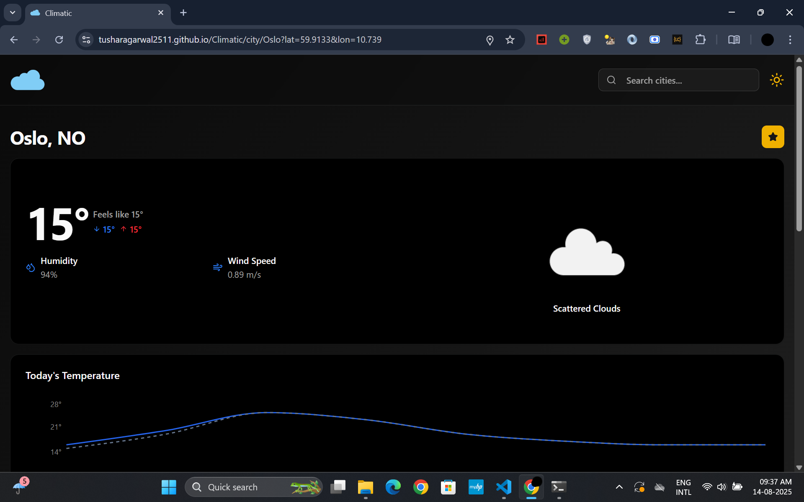
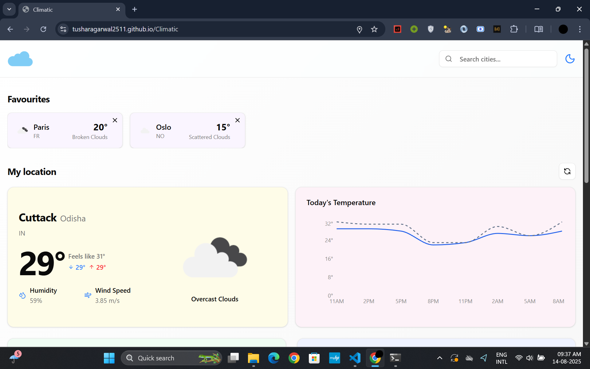

# 🌤 Climatic – Weather App  

A modern, responsive weather application built with **Vite**, **React**, **TypeScript**, and **Tailwind CSS**, powered by the **OpenWeatherMap API**.  
Easily search cities, view detailed forecasts, save favorites, and enjoy a smooth responsive UI with light & dark mode.  

---


---

🔗 **Live Demo:** [Climatic on GitHub Pages](https://tusharagarwal2511.github.io/Climatic)  

---

## ✨ Features  

- 🔍 **City Search** – Find real-time weather details for any city  
- ⭐ **Add to Favourites** – Quickly access your most searched cities  
- 🌗 **Light & Dark Mode** – Switch themes for comfortable viewing  
- 📅 **5-Day Forecast** – View temperature trends with interactive charts  
- 📊 **Data Visualization** – Weather trends displayed using **Recharts**  
- ⚡ **Fast & Reactive** – Caching with **TanStack Query** for seamless data fetching and offline support
- 📱 **Fully Responsive UI** – Built using **shadcn/ui** and **Tailwind CSS** for a consistent look across devices
- 🧪 **Tested with Vitest** – **63 test cases** passed from **18 test files** ensuring reliability

---

## 📸 Screenshots  

| | | |
|---|---|---|
|  |  |  |
|  |  |  |

---

## 🏗 Architecture

- **Frontend**: **React** (with **TypeScript**) for modular, type-safe UI components.  
- **State Management**: **TanStack Query** for caching, background fetching, and offline support.  
- **Styling**: **Tailwind CSS** + **shadcn/ui** for responsive, accessible design.  
- **Data Fetching**: **OpenWeatherMap API** with dynamic query parameters for location-based searches.  
- **Charts**: **Recharts** for weather trend visualization.  
- **Testing**: **Vitest** + **Testing Library** for unit and integration tests.  
- **Deployment**: **GitHub Pages** via **Vite** build output.

---

## 📊 Project Overview Diagram

The following diagram illustrates the data flow in **Climatic** from the user input to the weather dashboard:


---

## 🛠 Tech Stack  

- [Vite](https://vitejs.dev/)  
- [React](https://react.dev/)  
- [TypeScript](https://www.typescriptlang.org/)  
- [Tailwind CSS](https://tailwindcss.com/)  
- [shadcn/ui](https://ui.shadcn.com/)  
- [Recharts](https://recharts.org/)  
- [TanStack Query](https://tanstack.com/query/latest)  
- [OpenWeatherMap API](https://openweathermap.org/api)  

---

## 🚀 Quick Start / Installation  

Follow these steps to run **Climatic** locally:

### Prerequisites

- Node.js (v18+)
- npm/yarn/pnpm

**1. Clone the repository**  
```bash
git clone https://github.com/tusharagarwal2511/Climatic.git
cd Climatic
```

**2. Install dependencies**  
```bash
npm install
```

**3. Set up environment variables**

Create a `.env` file in the project root and add your OpenWeatherMap API key:

```env
VITE_OPENWEATHER_API_KEY=your_api_key_here

```
**4. Run the development server**  
```bash
npm run dev
```

**5. Build for production**  
```bash
npm run build
```

**5. Preview the production build**  
```bash
npm run preview
```

---

## 📜 License  

This project is licensed under the **MIT License** – feel free to use, modify, and share.  
