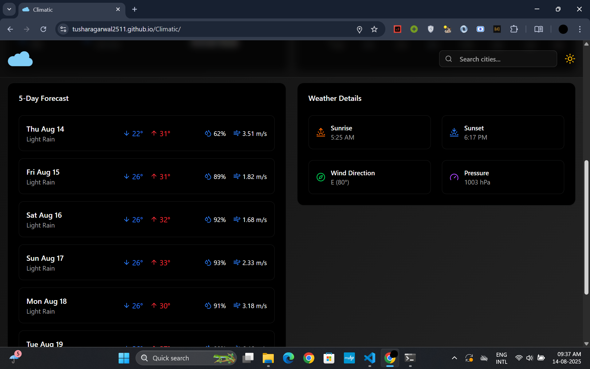

# 🌤 Climatic – Weather App  

A modern, responsive weather application built with **Vite**, **React**, **TypeScript**, and **Tailwind CSS**, powered by the **OpenWeatherMap API**.  
Easily search cities, view detailed forecasts, save favorites, and enjoy a smooth UI with light & dark mode.  

🔗 **Live Demo:** [Climatic on GitHub Pages](https://tusharagarwal2511.github.io/Climatic)  

---

## ✨ Features  

- 🔍 **City Search** – Find real-time weather details for any city  
- ⭐ **Add to Favourites** – Quickly access your most searched cities  
- 🌗 **Light & Dark Mode** – Switch themes for comfortable viewing  
- 📅 **5-Day Forecast** – View temperature trends with interactive charts  
- 📊 **Data Visualization** – Weather trends displayed using **Recharts**  
- ⚡ **Fast & Reactive** – Powered by **TanStack Query** for seamless data fetching and caching  

---

## 🛠 Tech Stack  

- [Vite](https://vitejs.dev/)  
- [React](https://react.dev/)  
- [TypeScript](https://www.typescriptlang.org/)  
- [Tailwind CSS](https://tailwindcss.com/)  
- [shadcn/ui](https://ui.shadcn.com/)  
- [Recharts](https://recharts.org/)  
- [TanStack Query](https://tanstack.com/query/latest)  
- [OpenWeatherMap API](https://openweathermap.org/api)  

---

## 📸 Screenshots & Demo  

### 🎥 Video Demo  
[▶ Watch the Demo](https://github.com/tusharAgarwal2511/Climatic/releases/download/v1.0.0/video.mp4)

### 🖼 Screenshots  

| | | |
|---|---|---|
|  |  |  |
|  |  |  |

---

## 📜 License  

This project is licensed under the **MIT License** – feel free to use, modify, and share.  
